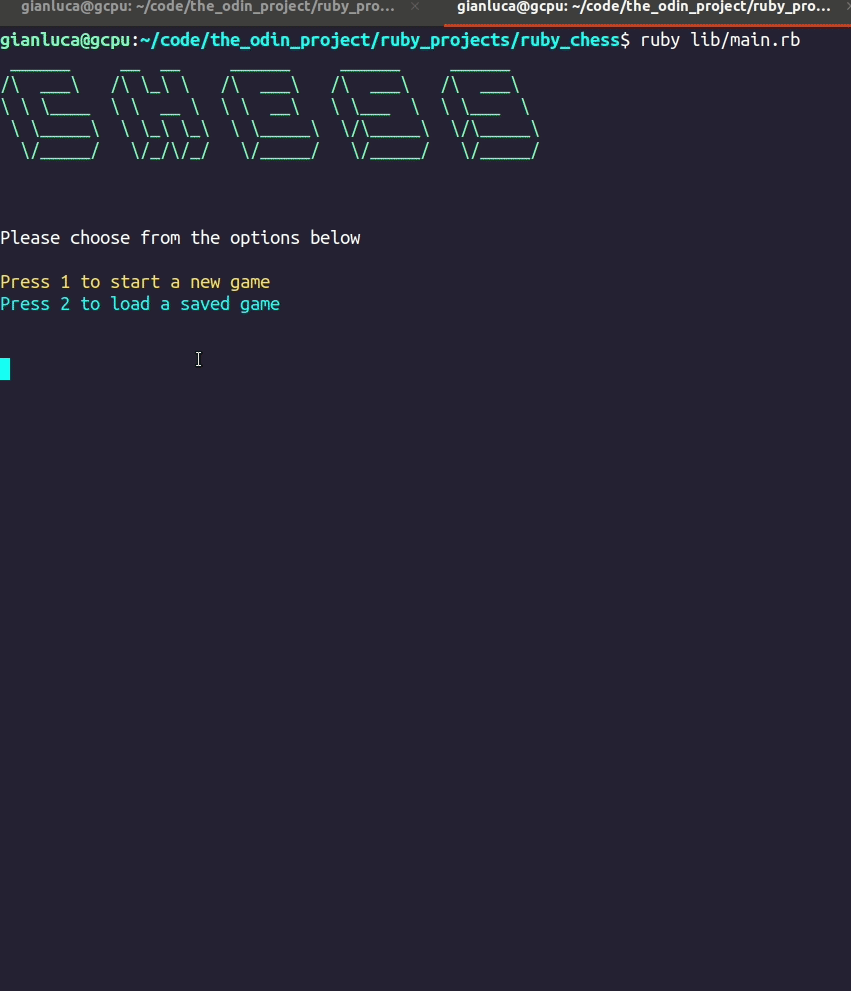

An implementation of chess made entirely in ruby. Created using TDD.

Try it here ~~>

This is actually my second attempt at this project. In my first attempt, it took me about a week and once I was finished, I was very displeased with how ugly the code looked.

I took a break and decided decided to read the book Clean Code. It really helped me to understand how to structure my code better, and the importance of testing everything.

I then proceeded to create this after finishing the book, and I have to say that I am much happier with this implementation. 

For the future of this project, some things I would like to consider adding are

-Highlighting previous moves
-Computer player
-Chess Engine